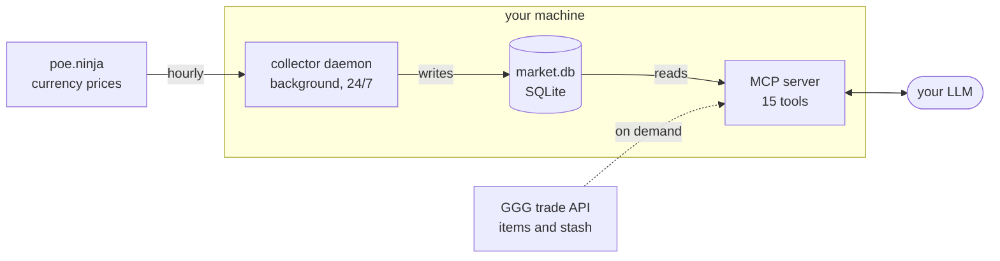

# POE2MarketMCP

A **local, single-user** tool that tracks Path of Exile 2 market data and
exposes it to an LLM over MCP: currency prices, per-league price history, and
stash valuation.

It runs on **your own machine**. A background collector polls market data on a
schedule and stores it in a local SQLite file; an MCP server reads that file to
answer your LLM's questions instantly, with no network call at query time.
Nothing is hosted, shared, or sent anywhere — it's your data, on your box.



**Data sources:** currency prices come from **poe.ninja** (the in-game Currency
Exchange, where PoE2 currency actually trades); item and stash lookups come from
**GGG's trade API**. The background collector hits only poe.ninja, so it never
touches your in-game trade rate budget; GGG is called only when you run a stash
or listing lookup yourself.

**History can't be backfilled** — the sources serve only current data, so price
history exists only for the period the collector has been running. Start it
early in a league.

## Quick start

```bash
uv venv && uv pip install -e .
poe2market init   # interactive: contact email + account
```

`init` writes `config/config.toml` for you — your contact email (GGG requires a
contact in the User-Agent; use a real one) and, optionally, your account handle
for stash valuation. `leagues` defaults to `["@current"]`, following league
rollover automatically.

```bash
poe2market collect --once          # one pass of every due job
poe2market validate                # check every watch target matches listings
poe2market status                  # what has been collected
poe2market install-daemon          # run it continuously via launchd
```

Run `validate` before each league: an over-constrained target never errors, it
just records an empty series until you notice.

## Rate limits

**poe.ninja (currency)** — CDN-cached ~30 min; the collector polls hourly, matching how often the data actually changes. Independent of GGG, so background collection never affects your
in-game trade.

**GGG trade API (items, stash)** — called only on demand. Limits are advertised
per response and enforced **per IP**, the same IP your game client uses:

| Endpoint | Limit |
|---|---|
| `search` | 600 / 21600s |
| `fetch` | 1000 / 21600s (10 listings each) |
| `exchange` | 30 / 300s |

Because the budget is shared with your game, live lookups are deliberately
sparing, and a cross-process ledger in SQLite keeps the collector and MCP server
from double-spending it.

### Prices carry confidence, not just a number

Thin books are common, and a wide bid/ask spread makes a midpoint misleading.
Every quote carries `spread_pct` and a `confidence` label. Conversions are
side-aware: buying uses the ask, stash valuation uses the bid.

## Watchlists

Currency comes from poe.ninja automatically. Named *items* are declared in
`config/watchlists/*.toml`, each with its own cadence and priority, so the
budget can be steered at whatever matters this week:

| List | Cadence | Purpose |
|---|---|---|
| `league-start` | 20 min | High-demand items while prices move hourly |
| `chase-uniques` | 2 h | Mageblood, Headhunter, Astramentis… |
| `crafting-bases` | 90 min | High-ilvl rare bases |

Three ways to specify a target, in increasing power:

```toml
[[target]]                      # a named unique
key = "uniq:mageblood"
kind = "unique"
name = "Mageblood"
type = "Utility Belt"

[[target]]                      # a base type, narrowed by filters
key = "base:stellar-amulet-i82"
kind = "base"
type = "Stellar Amulet"
[target.filters.misc_filters.filters.ilvl]
min = 82

[[target]]                      # anything else: a raw trade2 query
key = "base:tri-res-amulet"
kind = "raw"
[target.raw_query.query]
status = { option = "online" }
type = "Stellar Amulet"
```

Disable `league-start` (`enabled = false`) once prices settle; its 20-minute
cadence is deliberately aggressive and eats the search budget.

## MCP tools

**History** (local database — instant and free)

| Tool | Purpose |
|---|---|
| `get_price` | Latest price with spread and confidence |
| `get_price_history` | OHLC candles for charting |
| `get_movers` | Largest percentage moves |
| `search_items` / `list_watchlists` / `market_status` | Discovery and health |

**Live** (spends the shared rate budget)

| Tool | Purpose |
|---|---|
| `find_listings` | Current listings plus whisper text |
| `prepare_trade` | Best listing, price-checked against history |
| `find_arbitrage` | Currencies whose bid exceeds their ask |
| `list_leagues` | Leagues on the trade API |

**Stash** — `get_stash_value`, `get_stash_history`, `list_stash_items`

## Documentation

Split by audience — see [docs/README.md](docs/README.md).

**[`docs/agent/`](docs/agent/)** — served to connecting clients as MCP
resources. What a client reads is exactly these files.

| Document | Covers |
|---|---|
| [Tool reference](docs/agent/TOOL_REFERENCE.md) | All 15 tools: signatures, return shapes, examples, cost |
| [Setup](docs/agent/SETUP.md) | Install, config, daemon, watchlists, stash, troubleshooting |
| [Agent guide](docs/agent/AGENT_GUIDE.md) | Answering correctly: confidence, units, empty-vs-absent |
| [Data model](docs/agent/DATA_MODEL.md) | Price semantics, junk rejection, candles |
| [Rate limits](docs/agent/RATE_LIMITS.md) | Budgets, etiquette, compliance |

**[`docs/maintainers/`](docs/maintainers/)** — not exposed over MCP.

| Document | Covers |
|---|---|
| [Design](docs/maintainers/DESIGN.md) | Architecture, invariants, how to extend, testing |
| [Findings](docs/maintainers/FINDINGS.md) | What was measured live, with numbers |

Clients also get connect-time `instructions` and a live `poe2market://state`
resource (active league, coverage, remaining rate budget).

## On executing trades

**No API executes a PoE2 trade.** `fetch` returns a `whisper` string; the trade
itself is a manual whisper → party → trade window. Automating in-game input
violates GGG's terms and risks a ban.

So this server takes it to the line and stops: it finds listings, prices them,
ranks them, checks them against history, and hands you the exact whisper. A
human sends it. `prepare_trade` never contacts anyone.

## Stash valuation

Set your account handle; the tool reads your public trade listings and values
them at poe.ninja prices.

```toml
stash_account = "Name#1234"     # config.toml, or POE2MARKET_ACCOUNT
```

```bash
poe2market stash
```

**To expose your stash, set the tab public with a price in game** — name it
`~price 5 exalted` (or `~b/o 5 exalted`), or set the tab's price field. Only
items in a priced, public tab are indexed and visible; held or unpriced items
are not, and it reflects GGG's last crawl of your account (log in to refresh).
See [docs/agent/SETUP.md](docs/agent/SETUP.md).
## Storage

Three tiers, because raw ticks reach ~46M rows/year:

| Table | Retention | Read by |
|---|---|---|
| `price_sample` | 14 days | Recent detail, arbitrage |
| `price_hourly` | forever | Charts under ~14 days |
| `price_daily` | forever | League-long charts, movers |

Charts never scan raw ticks, which is what keeps a multi-league history fast in
a single file. DuckDB can `ATTACH` this database directly if heavier analytics
are ever wanted — no migration required.

## Operating the daemon

```bash
poe2market install-daemon     # load the launchd agent
poe2market status             # recent runs, coverage
tail -f logs/collector.log
poe2market uninstall-daemon   # stop and remove
```

## Tests

```bash
pytest -q
```

Covers rate-limit header parsing and cross-process budget sharing, bid/ask book
maths, rollup OHLC correctness and idempotency, and the currency-unit
separation that keeps divine-denominated listings out of exalted candles.

## License

MIT — see [LICENSE](LICENSE).
